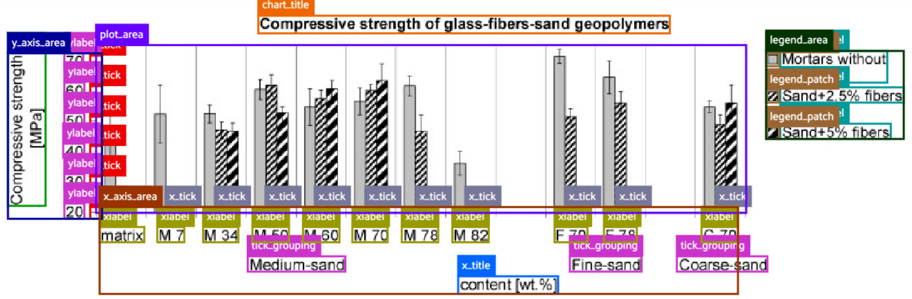
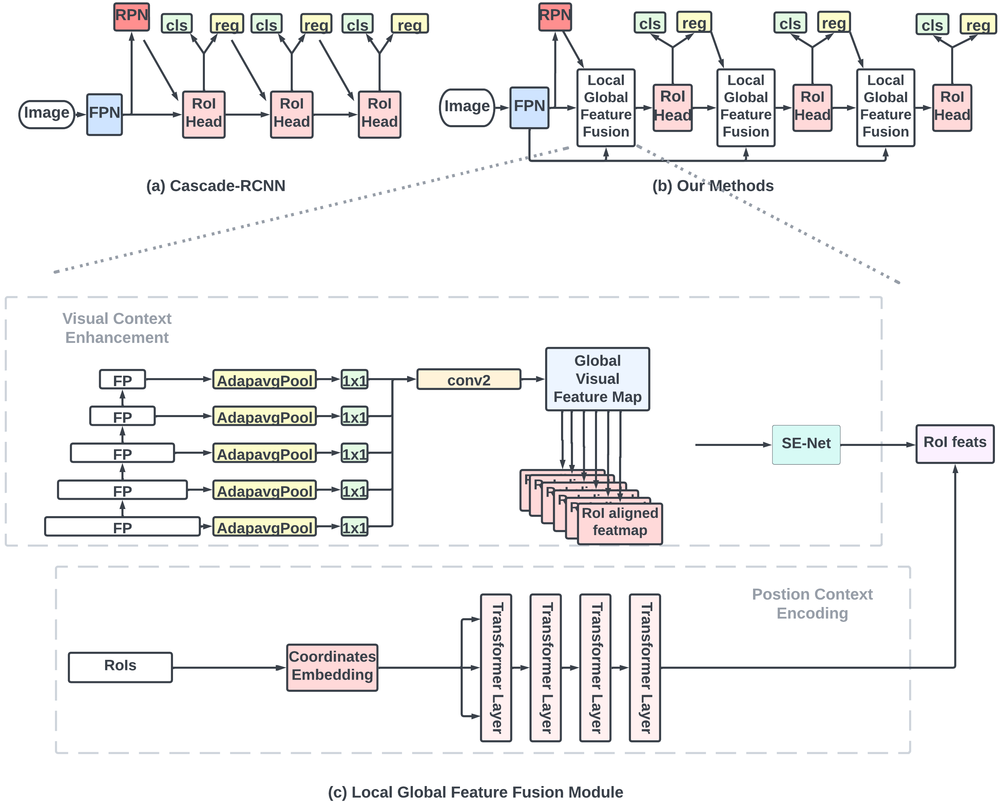
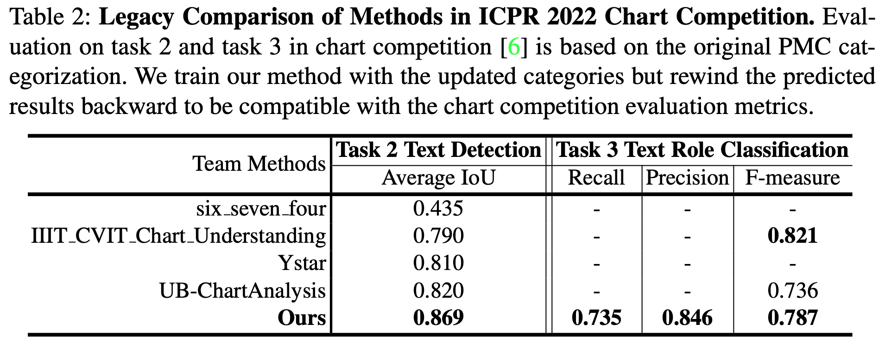
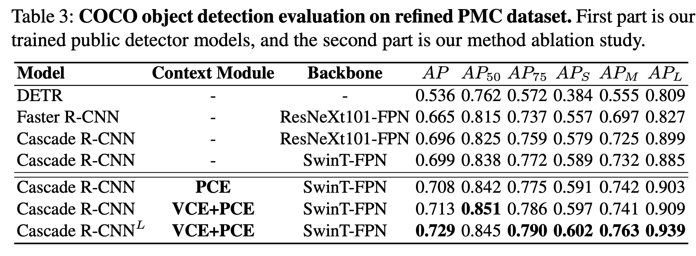
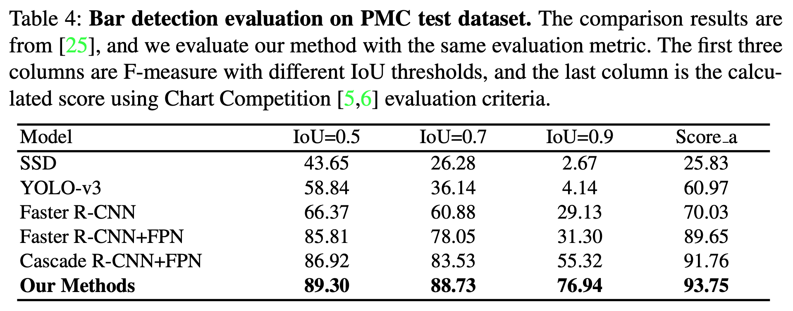
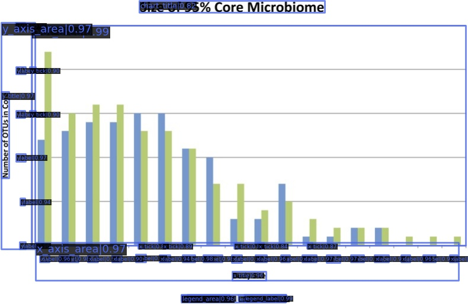

CACHED: Context-Aware Chart Element Detection
===

The github repository for ICDAR 2023 paper 'CACHED: Context-Aware Chart Element Detection'. The code is based on MMDetection Framework. The [Link]() to our paper.

- Updated PMC Dataset (COCO format) is available from [HERE](https://drive.google.com/file/d/16KxTBcX1N8VAKIwIoRPZprPHTr84Hsdf/view?usp=share_link), please unzip it to 'data/' folder.
- Models can be accessed in [HERE](https://drive.google.com/file/d/1n9UtHgfOA6H8cxp4Y44fG7OdXbVJzMnJ/view?usp=share_link), please download them and unzip them to 'work_dirs/' folder.
- Model Config files are under 'configs/'. 

<!-- **If you would like to cite our work:**
```latex

``` -->


## Introduction
### Our method



---



### Main Result

Here we attached the screenshots of table in our paper for your references:





**Note:** The models can be downloaded [HERE](https://drive.google.com/file/d/1n9UtHgfOA6H8cxp4Y44fG7OdXbVJzMnJ/view?usp=share_link), which include:
- DETR
- ResNet-101 Faster-RCNN
- ResNet-101 Cascade-RCNN
- SwinT-FPN Cascade-RCNN
- Our methods
- Our methods (bar chart detection)


## Updated PMC dataset
We analyze and refine the chart element categorization. Totally 18 classes of chart element are summarized. We updated the PMC chart dataset from ICPR 2022 Chart Competition according to the new category and convert them to COCO format. 

Download the data from [HERE](https://drive.google.com/file/d/16KxTBcX1N8VAKIwIoRPZprPHTr84Hsdf/view?usp=share_link), and unzip them to the './data/' folder.
```
|--data/
    |--pmc_2022/
        |--pmc_coco/      ## Converted COCO format with updated category
            |--element_detection/
                |--train/
                |--val/                   ## Image files
                |--split3_test
                |--train.json 
                |--val.json               ## Json coco ann files
                |--split3_test.json 
            |--element_detection/
                |--bar_train.json 
                |--bar_images/            ## Similarly to above
                |--...
        |--train_original/
            |--...                        ## Those are original ICPR 2022
        |--test_original/                 ## chart competition dataset
            |--...                        
```
The **chart element category refinement code and coco converter** can be found under "./pmc2coco_coverter/" folder.

## Model Usage
### Install Environment

This code is based on MMdetection Framework, please refer to MMDetection Official [Website](https://github.com/open-mmlab/mmdetection) for detailed installation. The following is brief environment and installation:

Pytorch 1.13.1 and CUDA 11.7 are used during building and testing.

Create Conda Environment:
```bash
conda create -n ChartDete python=3.8
conda activate ChartDete
```

Make sure CUDA 11.7 with correct cudnn version is installed in your environment, then install pytorch 1.13.1:
```bash
conda install pytorch==1.13.1 torchvision==0.14.1 torchaudio==0.13.1 pytorch-cuda=11.7 -c pytorch -c nvidia
```

Install mmcv:
```bash
pip install -U openmim
mim install mmcv-full
```

The newest mmdetection has replaced the mmcv-full with mmcv 2.0, but it would raise compatibale issue for our code, therefore, we use mmcv-full here.

Install MMDetection:
```
git clone https://github.com/pengyu965/ChartDete
cd ChartDete
pip install -v -e .
```

### Inference
The model config files and weights need to be paired correctly for usage. Model weights could be download from above link, please unzip them to './work_dirs/'.

The inference follows the MMDetection routine, please refer to the official [tutorial](./docs/en/1_exist_data_model.md).

A simple demo is here for your convenience:
```python
from mmdet.apis import init_detector, inference_detector
import mmcv

# Specify the path to model config and checkpoint file
config_file = './work_dirs/cascade_rcnn_swin-t_fpn_LGF_VCE_PCE_coco_focalsmoothloss/cascade_rcnn_swin-t_fpn_LGF_VCE_PCE_coco_focalsmoothloss.py'
checkpoint_file = './work_dirs/cascade_rcnn_swin-t_fpn_LGF_VCE_PCE_coco_focalsmoothloss/checkpoint.pth'

# build the model from a config file and a checkpoint file
model = init_detector(config_file, checkpoint_file, device='cuda:0')

# test a single image and show the results
img = './sample.jpg'  # or img = mmcv.imread(img), which will only load it once
result = inference_detector(model, img)
# visualize the results in a new window
model.show_result(img, result)
# or save the visualization results to image files
model.show_result(img, result, out_file='./sample_result.jpg')
```

The output image:

